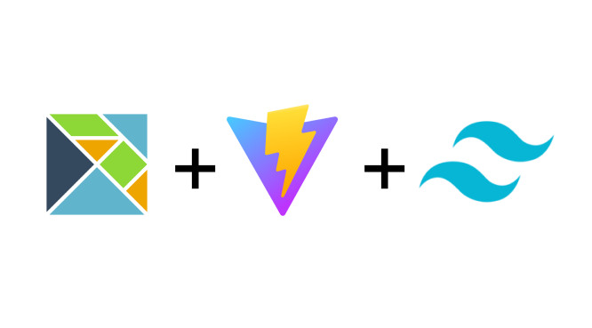

<a name="readme-top"></a>

<h1 align="center">Project created with <a href="https://github.com/data-miner00/elm-vite-template">this template</a></h1>

<!-- PROJECT LOGO -->
<br />
<div align="center">
  <a href="/">
    
  </a>

  <h3 align="center">Elm Vite Template</h3>

  <p align="center">
    Minimalistic Elm Template powered by Vite!
    <br />
    <a href="https://elm-vite-template.vercel.app"><strong>View Demo »</strong></a>
    <br />
    <br />
    <a href="https://github.com/data-miner00/elm-vite-template">Explore the docs</a>
    ·
    <a href="https://github.com/data-miner00/elm-vite-template/issues">Report Bug</a>
    ·
    <a href="https://github.com/data-miner00/elm-vite-template/issues">Request Feature</a>
  </p>
</div>

<!-- ABOUT THE PROJECT -->

## About The Project

<!--  -->

A simple webApp using Elm where you can load a csv and retrieve a interactive table and some graphs.
<br>

<h2>Format</h2>
<code>Id,Balance,Amount,Currency,Type,Status,Modified,Trade Id,Instrument Symbol,Instrument Name,Commission,Account type</code>
<br>
<code>"75311057400111","16172.09","4.66","EURd","TRADE","PROCESSED","2024-10-12 20:50:31","0015421d-0055-311e-0000-4e28000a8aa4_0015421d-0055-311e-0000-000081309791","ETH/USD","Ethereum / USD","",""</code>

<h2>Built with</h2>
The language, packages and technologies used in this project
<ul>
  <li>Elm</li>
  <li>terezka/elm-charts</li>
  <li>BrianHicks/elm-csv</li>
  <li>Vite</li>
  <li>TailwindCss</li>
</ul>


<!-- GETTING STARTED -->

<h2>Getting Started</p2>

<h3>Prerequisites<h3>

The list of tools that is used when development.

- npm
  ```sh
  npm install npm@latest -g
  ```
- [Git](https://git-scm.com/downloads)
- [Elm](https://elm-lang.org/)

### Installation

To use this template for personal use or contribution, simply perform the following.

1. Clone the repo
   ```sh
   git clone https://github.com/LuisMiguelTrinidad/ELM_DEMO.git
   ```
2. Install Node dependencies
   ```sh
   npm i
   ```
3. Optionally update the dependencies
   ```sh
   npm up --latest
   ```
4. Run formatter to format code
   ```sh
   npm format
   ```
5. Review Elm code quality
   ```sh
   npm review
   ```
6. Start dev server
   ```sh
   npm dev
   ```
7. Compile for production
   ```sh
   npm build
   ```
8. Preview production build
   ```sh
   npm preview
   ```
9. Start standalone Elm reactor
    ```sh
    npm elm:dev
    ```
10. Build standalone Elm code
    ```sh
    npm elm:build
    ```
11. Start interactive Elm shell
    ```sh
    npm repl
    ```

<p align="right">(<a href="#readme-top">back to top</a>)</p>

<!-- ROADMAP -->

## Roadmap

- [x] Add Homepage
- [ ] Add 404 page
- [ ] Dark mode
- [ ] Add GitHub workflows
- [ ] Add PWA Manifest
- [ ] Mobile Responsive
  - [ ] Navbar and header
- [ ] Add E2E tests

See the [open issues](https://github.com/data-miner00/elm-vite-template/issues) for a full list of proposed features (and known issues).

<p align="right">(<a href="#readme-top">back to top</a>)</p>

<!-- CONTRIBUTING -->

## Contributing

Contributions are what make the open source community such an amazing place to learn, inspire, and create. Any contributions you make are **greatly appreciated**.

If you have a suggestion that would make this better, please fork the repo and create a pull request. You can also simply open an issue with the tag "enhancement".
Don't forget to give the project a star! Thanks again!

1. Fork the Project
2. Create your Feature Branch (`git checkout -b feature/AmazingFeature`)
3. Commit your Changes (`git commit -m 'Add some AmazingFeature'`)
4. Push to the Branch (`git push origin feature/AmazingFeature`)
5. Open a Pull Request

<p align="right">(<a href="#readme-top">back to top</a>)</p>

<!-- LICENSE -->

## License

Distributed under the Apache 2.0 License. See `LICENSE` for more information.

<p align="right">(<a href="#readme-top">back to top</a>)</p>

<!-- ACKNOWLEDGMENTS -->

## Acknowledgments

List of resources that are helpful and would like to give credit to.

- [Elm Lang](https://elm-lang.org/)
- [Elm Packages](https://package.elm-lang.org/)
- [Vite Plugin Elm](https://github.com/hmsk/vite-plugin-elm/)
- [Vite Elm Template](https://github.com/lindsaykwardell/vite-elm-template)
- [Elm Spa Example](https://github.com/rtfeldman/elm-spa-example)
- [Elm Tooling](https://elm-tooling.github.io/elm-tooling-cli/)
- [Elm Parcel Template](https://github.com/kutyel/elm-parcel-template)
- [25 Elm Examples](https://github.com/bryanjenningz/25-elm-examples)
- [Elm Programming](https://elmprogramming.com/)
- [elm-test-rs](https://github.com/mpizenberg/elm-test-rs)
- [Elm Radio](https://elm-radio.com/)
- [Elm init next steps](https://github.com/elm/compiler/blob/master/hints/init.md)
- [elm-review](https://package.elm-lang.org/packages/jfmengels/elm-review/latest/)
- [Using Tailwind CSS in Elm and VSCode](https://max.hn/thoughts/using-tailwind-css-in-elm-and-vscode)
- [Getting Started with the Elm Programming Language](https://www.toptal.com/front-end/getting-started-elm-language)

<p align="right">(<a href="#readme-top">back to top</a>)</p>

<!-- MARKDOWN LINKS & IMAGES -->

[contributors-shield]: https://img.shields.io/github/contributors/data-miner00/elm-vite-template.svg?style=for-the-badge
[contributors-url]: https://github.com/data-miner00/elm-vite-template/graphs/contributors
[forks-shield]: https://img.shields.io/github/forks/data-miner00/elm-vite-template.svg?style=for-the-badge
[forks-url]: https://github.com/data-miner00/elm-vite-template/network/members
[stars-shield]: https://img.shields.io/github/stars/data-miner00/elm-vite-template.svg?style=for-the-badge
[stars-url]: https://github.com/data-miner00/elm-vite-template/stargazers
[issues-shield]: https://img.shields.io/github/issues/data-miner00/elm-vite-template.svg?style=for-the-badge
[issues-url]: https://github.com/data-miner00/elm-vite-template/issues
[license-shield]: https://img.shields.io/github/license/data-miner00/elm-vite-template.svg?style=for-the-badge
[license-url]: https://github.com/data-miner00/elm-vite-template/blob/master/LICENSE
